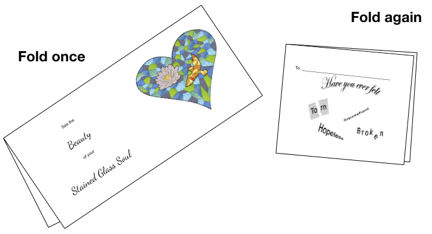
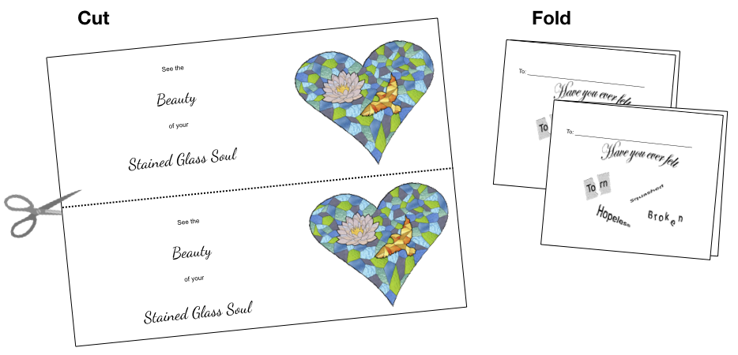

# Print and share a message of encouragement

Several different options are available to print and share a card with friends and loved ones:

### One sheet of paper

This is for printing on one sheet of regular paper - fold twice and share. Pick the version you want:

* [If you want to color the card yourself](https://github.com/johnsonra/StainedGlassHearts/raw/master/assets/images/StainedGlassHearts-PlainCard-1pg.pdf)
* [If you don't want to color the card yourself](https://github.com/johnsonra/StainedGlassHearts/raw/master/assets/images/StainedGlassHearts-ColorCard-1pg.pdf)

### Front and back printing

This is for printing front and back on a sheet of card stock. Cut down the center of the page, fold once for each card and share. Pick the version you want:

* [If you want to color the card yourself](https://github.com/johnsonra/StainedGlassHearts/raw/master/assets/images/StainedGlassHearts-PlainCard-1pgs.pdf)
* [If you don't want to color the card yourself](https://github.com/johnsonra/StainedGlassHearts/raw/master/assets/images/StainedGlassHearts-ColorCard-2pgs.pdf)